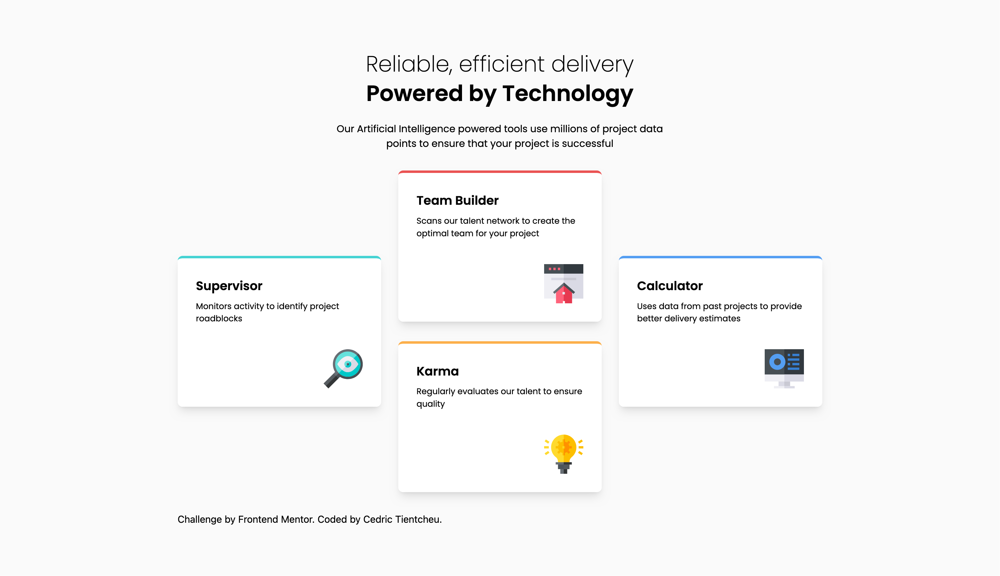

# Frontend Mentor - Four card feature section solution

This is a solution to the [Four card feature section challenge on Frontend Mentor](https://www.frontendmentor.io/challenges/four-card-feature-section-weK1eFYK). Frontend Mentor challenges help you improve your coding skills by building realistic projects.

## Table of contents

- [Frontend Mentor - Four card feature section solution](#frontend-mentor---four-card-feature-section-solution)
  - [Table of contents](#table-of-contents)
  - [Overview](#overview)
    - [The challenge](#the-challenge)
    - [Screenshot](#screenshot)
    - [Links](#links)
  - [My process](#my-process)
    - [Built with](#built-with)
    - [What I learned](#what-i-learned)
    - [Continued development](#continued-development)
    - [Useful resources](#useful-resources)
  - [Author](#author)

## Overview

### The challenge

Users should be able to:

- View the optimal layout for the site depending on their device's screen size

### Screenshot



### Links

- Solution URL: [Add solution URL here](https://your-solution-url.com)
- Live Site URL: [Add live site URL here](https://your-live-site-url.com)

## My process

### Built with

- Semantic HTML5 markup
- Tailwind CSS
- Flexbox
- CSS Grid
- Desktop First Approach

### What I learned

As the design was a little bit complex to what I've come accross on the frontend mentor challenge so far, structuring the html was a challenge for me.

As, I wasn't sure how I going to structure it to match the design. Which was, wrapping the all the sections inside a container and have css grid do the work for me, which made it more challeging for me.

So, I did a little bit of research on how others have tackle this (resources are below), I've realise simplicity is the key. I learnt to structure html elements that made sense for all devices
and not only for a specific device.

Below are snippets of my initial thoughs at first, and the end result.

My First Solution:

````html
<article class="container">
	<section></section>
	<section></section>
	<section></section>
	<section></section>
</article>

The End Result: ```html
<article class="container">
	<section></section>
	<div class="wrapper">
		<section></section>
		<section></section>
	</div>
	<section></section>
</article>
````

### Continued development

Will continue to learn more on structuring html, and using the correct html elements to define the context.

### Useful resources

- [Kevin Powel](https://youtu.be/JFbxl_VmIx0?si=8HMLOKGwF70FxSEc) - This helped me with structuring the HTML.

## Author

- LinkedIn - [cedrictientcheu](www.linkedin.com/in/cedrictientcheu)
- Frontend Mentor - [@cedric-91](https://www.frontendmentor.io/profile/cedric-91)
